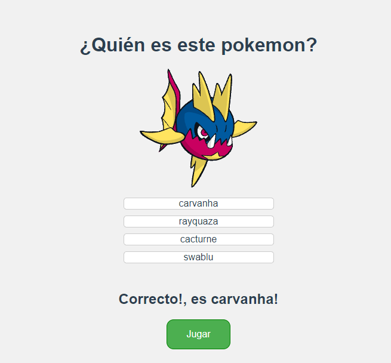

# Pokemon Game app

A simple app where you have to select the name of the pokemon that hides behind the black silhouette.



## Link to Pokemon Game app

https://vue-pokemon-api.netlify.app/

## Technologies

**VUE, CSS**

## Project setup

```
npm install
```

### Compiles and hot-reloads for development

```
npm run serve
```

### Compiles and minifies for production

```
npm run build
```

### Run your unit tests

```
npm run test:unit
```

### Customize configuration

See [Configuration Reference](https://cli.vuejs.org/config/).
